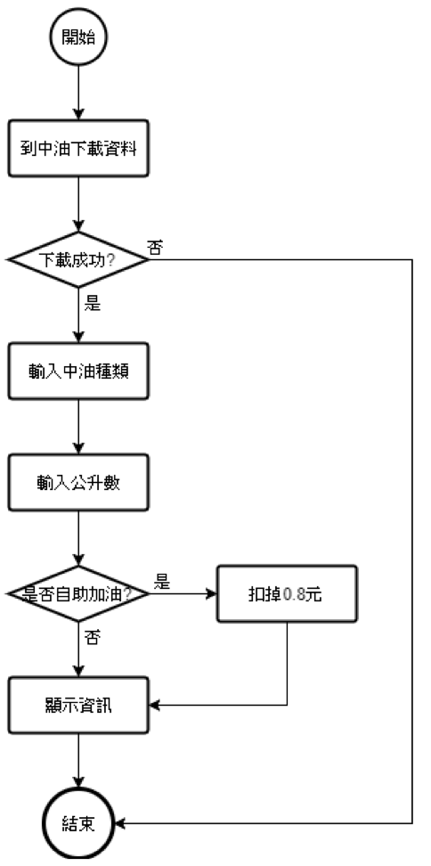
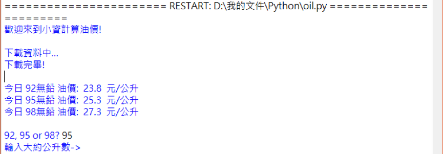
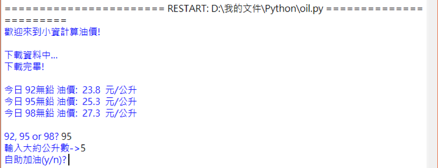
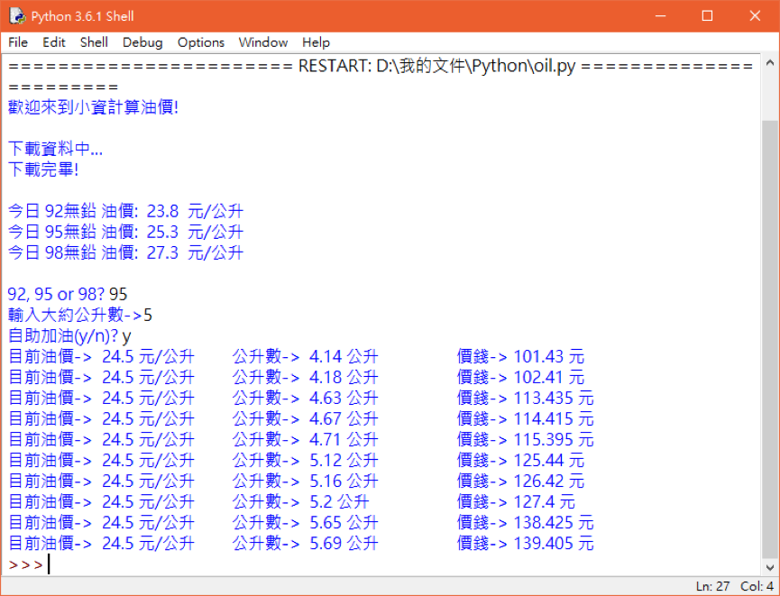

小資計算油價  
===
###動機及目的  

在民生物資不降反漲的時代，大家也越來越重視開源節流的概念，所謂的小資族，就是在能省的地方省下不必要的消費。  
以前常常在電視或者新聞中聽到省錢達人說，加油時要取整數，例如加5.00公升或者40.01公升等小數接近零的數字; 也會有人說要靠近整數而不大於整數的數字，例如4.98公升或39.96公升等，眾說紛紜。  

但正確來說，中油計價是以小數點四捨五入，例如:
```
25.4 (元/公升)   *   5.03 (公升)   =   127.762 (元)
```
中油則會收你128元，冥冥之中虧了0.238元。

另一個例子:  
```
25.4 (元/公升)   *   5.01 (公升)   =   127.254(元)
```
中油收你127元，賺0.254元。

同理可知，在一次加油中，最高可以省0.44元，或者虧0.55元，並無上述的靠近整數說法。
 
###程式流程圖
  

###程式操作
測試環境:  
Windows 10 64-bit  
Python 3.6.1  

  
▲輸入中油種類  

   
▲輸入公升數，計算範圍為±1  

  
▲輸入是否為自助加油，選擇是的話油價會扣掉0.8元  

  
▲油價計算顯示  

###說明:
從上述可得知，今日 (8/31) 95無鉛油價為25.3 元/公升，自助加油扣掉0.8元，為24.5元/公升，計算公升數範圍從4.00~6.00公升，所有符合小數點介於0.4與0.44之間的都會被顯示出來，由此可知最省錢的公升數為5.12公升，為125.44元。

###總結
本程式使用網路爬蟲的方式，讓資訊可以自動更新，省去連線到官方網頁的麻煩，跨平台的程式語言可以運用在Windows, Linux及Mac OS各種支援Python的平台，唯一的小缺陷是不支援行動作業系統，如Android及iOS，這也對這個程式的便利性及實用性大打折扣，但這個程式對我來說是網路爬蟲的初次練習，也是出自於自己生活上的例子，所以特別撰寫之，學習及想法實現成分多於上述的方便性。
